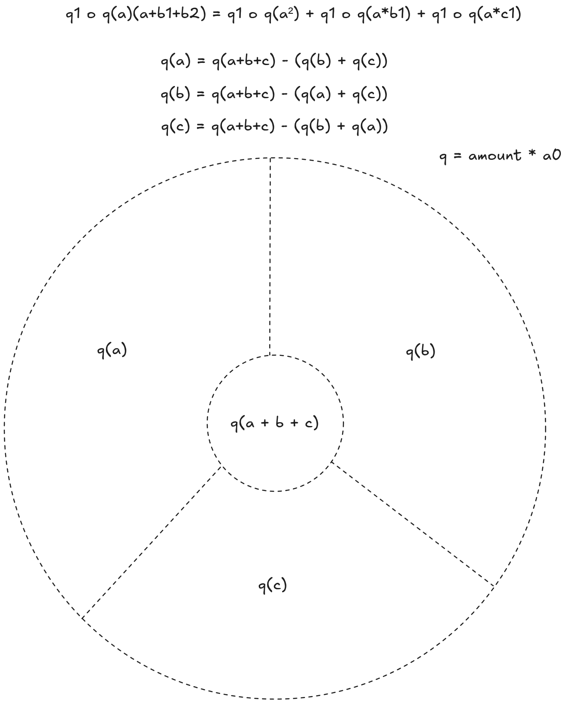

# degree-three-phi-crypto

A small Rust blockchain experiment using BLS12-381 `did:key` identifiers.

## Phi Identity Console

The local-first console manages privacy-scoped DIDs, hierarchical roles, owned
identity information, and consented information exchanges. It keeps information
ownership separate from the person described, so receiving a claim about
another subject does not make that claim the recipient's own trait.
Private values use AES-GCM encryption, verified values carry an owner BLS
signature, and public values remain cleartext.

Exchanges create tamper-evident trait commitments and require sender and
recipient BLS signatures. An optional witness can explicitly approve and sign
the transaction. Receipts support expiry, revocation, selective party reveal,
candidate-DID verification, and bounded redisclosure using
`group_amount = 2^max_depth`.

Run it with:

```bash
cargo run --bin identity_console
```

Then open `http://127.0.0.1:8790`. The Rust runtime generates genuine
BLS12-381 `did:key` identifiers and authority attestations. Workspace data stays
in browser `localStorage`; secret keys stay only in the process's in-memory
vault and are lost on restart. The chain stores the accepted aggregate
`degree_three_phi_token` and its authority signature, while detailed party and
amount evidence remains off-chain.

## Amount Protocol

An amount is a small integer less than 100. The amount authority is not stored
as a block participant. For a fresh transaction, the `amount_token_group` starts
from the authority DID key. For a linked duplicate transaction, where the
previous participant becomes the next subject, the `amount_token_group` starts from
the previous participant amount token:

```text
fresh amount_token_group = authority_key
linked amount_token_group = previous_participant_amount_token
```

The parties derive an amount token for each participating role:

```text
amount_token_subject = amount_token_group + amount * subject_key
amount_token_witness = amount_token_group + amount * witness_key, when present
amount_token_participant = amount_token_group + amount * participant_key
```

These are public group keys. They prove the block used the same amount
duplication count for each role key.

Each participating party signs its own role amount token:

```text
subject_signature = sign(subject_key, amount_token_subject)
witness_signature = sign(witness_key, amount_token_witness), when present
participant_signature = sign(participant_key, amount_token_participant)
```

The submitted `degree_three_phi_token` is the aggregate of those signatures:

```text
degree_three_phi_token =
  subject_signature + optional(witness_signature) + participant_signature
```

During block creation, the block verifies the submitted aggregate and the
authority signs the accepted degree three phi token:

```text
degree_three_phi_token_authority_signature =
  sign(authority_key, "authorize degree-three-phi-crypto degree three phi token {degree_three_phi_token}")
```

At block creation, the chain recomputes the role amount tokens, checks that
each party signed the correct role token, checks that the submitted
`degree_three_phi_token` matches the aggregate signatures, and verifies the authority
signature over the resulting `degree_three_phi_token`.

Later chain validation can verify the persisted receipt and block hash, but it
cannot replay the full three-party transaction proof from the block alone
because the block no longer stores the amount or DID records.

## Three-Party Block Verification



The three parties can still verify a block together if they retain or exchange
the transaction witness data used at creation time:

```text
amount
subject DID record and signature
witness DID record and signature
participant DID record and signature
previous participant amount token, for chained transactions
```

Given that witness data and the stored block receipt, they verify:

```text
role amount tokens recompute from amount and DID records
each party signature verifies its role amount token
subject_signature + witness_signature + participant_signature == degree_three_phi_token
degree_three_phi_token_authority_signature verifies authority approval of degree_three_phi_token
```

Without that external witness data, the stored block proves only that the
authority approved the aggregate `degree_three_phi_token`; it does not reveal or
reconstruct the three parties, their roles, or the amount.

## Amount Token Duplication Caveat

The amount duplication rule is about the subject of a chained transaction:

```text
amount_token_subject = amount_token_group + amount * subject_key
```

When the previous participant becomes the new subject, `amount_token_group` is
the previous participant amount token. The subject sum can show the structural
duplication of `amount * subject_key`, but the sum alone is not sufficient to
prove the claimed `amount_token_subject`.

The impersonation issue is that a structurally valid group sum can be presented
as if it came from a claimed subject. The expression can contain an
`amount * subject_key` term, but the sum alone does not prove that the claimed
subject DID authorized that term or agreed to act as the subject in the
transaction.

The important security check is the per-role signature verification:

```text
subject_signature verifies subject_did over amount_token_subject
witness_signature verifies witness_did over amount_token_witness
participant_signature verifies participant_did over amount_token_participant
```

The subject signature binds the duplicated subject amount token to the claimed
subject DID. The witness and participant signatures bind their own role-specific
amount tokens to their DIDs. The aggregate `degree_three_phi_token` is then
checked as:

```text
subject_signature + witness_signature + participant_signature == degree_three_phi_token
```

It should be treated as a compact receipt for those verified signatures, not as
a standalone proof of identity, role assignment, or non-reuse.

## Can Two Parties Deduce The Third DID?

No.

Two parties cannot derive the third party DID from only:

```text
degree_three_phi_token
degree_three_phi_token_authority_signature
their own amount tokens
their own signatures
```

The reason is that `degree_three_phi_token` is an aggregate of BLS signatures, not an
aggregate of public DID keys. Removing two known signatures from the aggregate
can reveal the remaining signature value, but a BLS signature does not reveal
the signer's public key. Recovering the public key from that signature would be
equivalent to breaking the underlying elliptic-curve discrete-log assumption.

The authority signature does not change that. It attests that the authority saw
and accepted the aggregate degree three phi token, but it does not make the aggregate
reversible into the hidden party's DID.

What two parties can do is verify a candidate DID if someone presents one. Given
the candidate DID, the role-specific challenge, and the candidate signature,
they can check whether the candidate verifies against the aggregate protocol.

So the distinction is:

- Derivation: not possible from the aggregate proof alone.
- Candidate verification: possible when a candidate DID/signature is supplied.

To verify a known candidate third DID, two parties check the candidate against
the public block result:

```text
candidate_signature verifies candidate_did over candidate_role_amount_token
candidate_signature + known_signature_1 + known_signature_2 == degree_three_phi_token
degree_three_phi_token_authority_signature verifies authority approval of degree_three_phi_token
```

In other words, the candidate DID is accepted only if its signature verifies the
candidate role amount token and the three signatures aggregate back to the
block's `degree_three_phi_token`.

This means the protocol can prove participation by known DIDs, but it is not a
DID discovery mechanism.

## Load Test

Run parallel random token exchanges with:

```bash
cargo run --bin load_test -- --workers 4 --ops 250 --parties 32 --difficulty 1 --print-blocks
```

Omit `--print-blocks` for longer runs. The load test prints accepted/rejected
operation counts, two-party proof checks, final chain validity, and elapsed
time.

## Amount Token Submission API

### Run The API

Run a local amount token API with:

```bash
cargo run --bin amount_token_api -- 127.0.0.1:8787
```

The API starts an in-memory blockchain with a hardcoded demo authority key
derived from seed `42`. Check its status with:

```bash
curl http://127.0.0.1:8787/blockchain
```

### Demo DID Keys

Hardcoded demo DID keys are:

```text
subject DID: did:key:z3tEFHKPLWzgC9mXrQj6PiDzxmfMCPdb1JUWkWnaeaZCXDRhHhmjv5knBohRaZEncfsr5i
witness DID: did:key:z3tEG1BgUeeVmofi5MV3cU7LaYeocm9Ne2QkBPDdpDozyBCKjYgWa1VpStYho9EhC9P7vh
participant DID: did:key:z3tEGSKFD3nuGm4JqErNTVUYzeksa2Hs6P3C9rpFp93CbYQNDkyScdC7JPa8xojkatS4kA
```

### Amount Token Derivation

Derive an amount token from the authority DID key with:

```bash
curl 'http://127.0.0.1:8787/amount-token?amount=7'
```

To derive it from another DID key, pass `challenge` explicitly:

```bash
curl 'http://127.0.0.1:8787/amount-token?amount=7&challenge=did%3Akey%3A...'
```

### Single Challenge Signing

Open a challenge URL to display a client submission form for one
`amount_token` challenge:

```text
http://127.0.0.1:8787/amount-token/challenge?role=subject&challenge=did%3Akey%3Aexample
```

The page derives the demo `did_key` from the `role`. Its JavaScript signs the
challenge automatically for the hardcoded demo keys, fills the `signature`
field, and submits the form. For a real wallet, replace the default demo signer
with `window.phiCryptoSign`.

Manual submission is still supported:

```bash
curl -X POST http://127.0.0.1:8787/amount-token/submit \
  -H 'content-type: application/x-www-form-urlencoded' \
  --data 'role=subject&did_key=did%3Akey%3A...&challenge=did%3Akey%3Aexample&signature=...'
```

It returns:

```json
{
  "did_key": "did:key:...",
  "role": "subject",
  "proof": {
    "challenge": "did:key:example",
    "signature": "..."
  }
}
```

The signed challenge is returned as `proof.challenge` plus `proof.signature`,
and the response is shaped so it can be passed into the next role-signature
collection step.

### Block Creation Flow

Start a full subject -> witness -> participant signing flow with:

```text
http://127.0.0.1:8787/amount-token/start?amount=7
```

Skip the optional witness with:

```text
http://127.0.0.1:8787/amount-token/start?amount=7&witness=false
```

The start route redirects to the first challenge page. Challenge pages do not
keep the three role DIDs in query parameters or form fields. Instead, they
display the hardcoded demo subject, witness, and participant DIDs in the page
body under `example DIDs`.

For local demos, challenge construction uses those hardcoded demo DIDs. The
client or wallet must sign each role challenge locally and POST the DID plus
signature.

Each valid POST appends the signed submission into a `submissions` query
parameter and redirects through:

```text
subject -> optional(witness) -> participant -> block creation
```

After the participant signs, the API aggregates the submissions into
`degree_three_phi_token`, adds a block to the in-memory blockchain, and returns
an HTML block creation receipt.

## License

This project is licensed under the MIT License. See [LICENSE](LICENSE).
